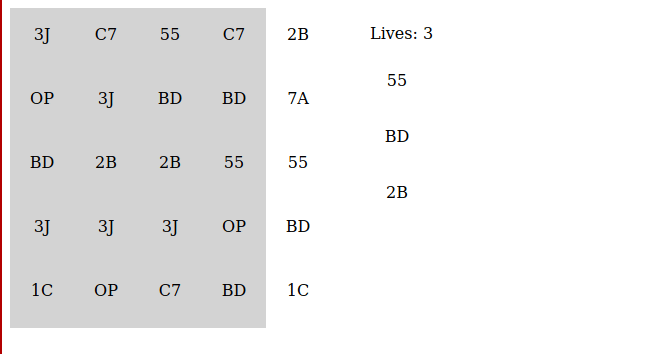

# React Cyberpunk 2077 Breach Protocol 

This quick project is a web replica of Cyberpunk 2077's Quick Hack Breach Protocol. Just a fun little puzzle. If you are not familiar, I suggest you watch this [ video ](https://youtu.be/1ffmb7tYNxo?t=108). 

Its not entirely perfect but please...go ahead...play!

## Example

## API Reference

### `<QuickHackBreach />`

- Props:
	- `bufferWidthAndHeight` 
		-	Type - Number
		-	*Optional*
		-	Default - 5
		-	Defines the width and height of the puzzle
	- `amountToCrack` 
		- Type - Number
		- *Optional*
		- Default - 3
		- Defines how many buffers needed for you to complete the puzzle
		- Also defines how many tries you have before you fail the puzzle

## Start up

1. Run `npm install`
2. Run `npm run start` - runs local server using Parcel

